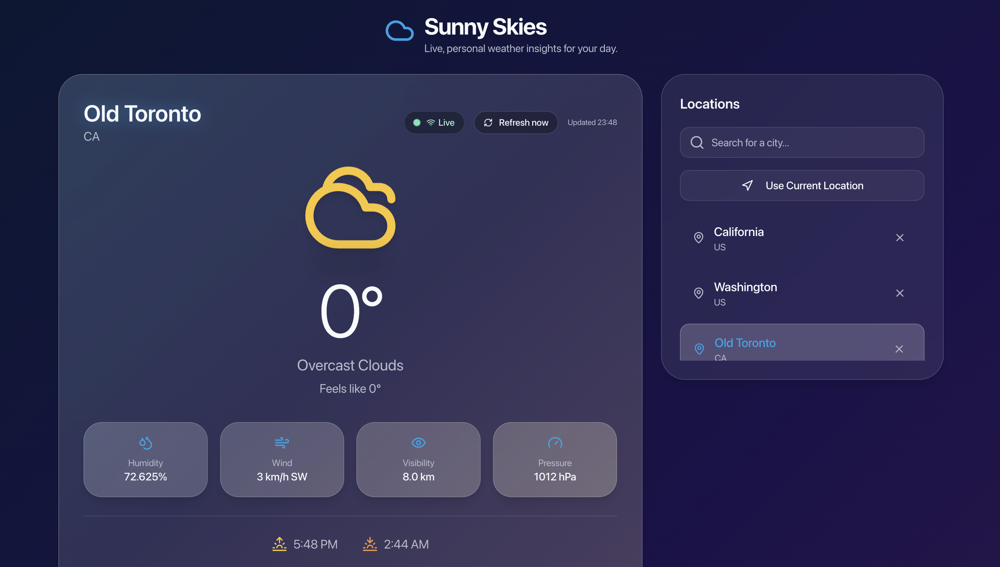
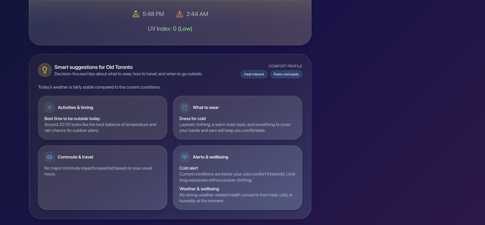
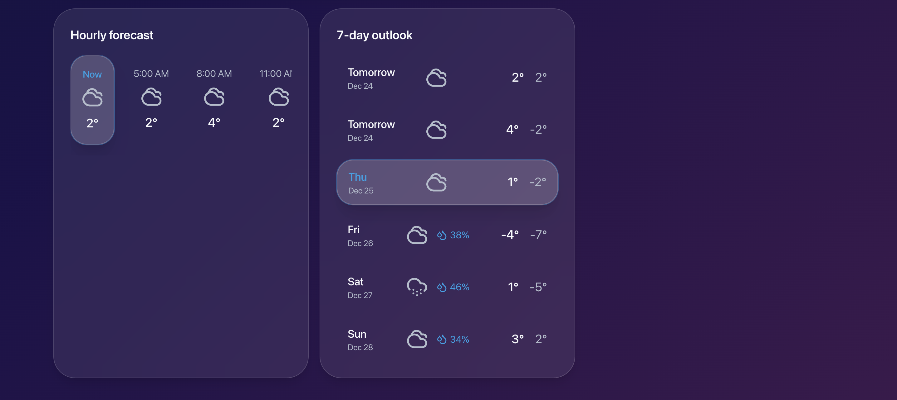
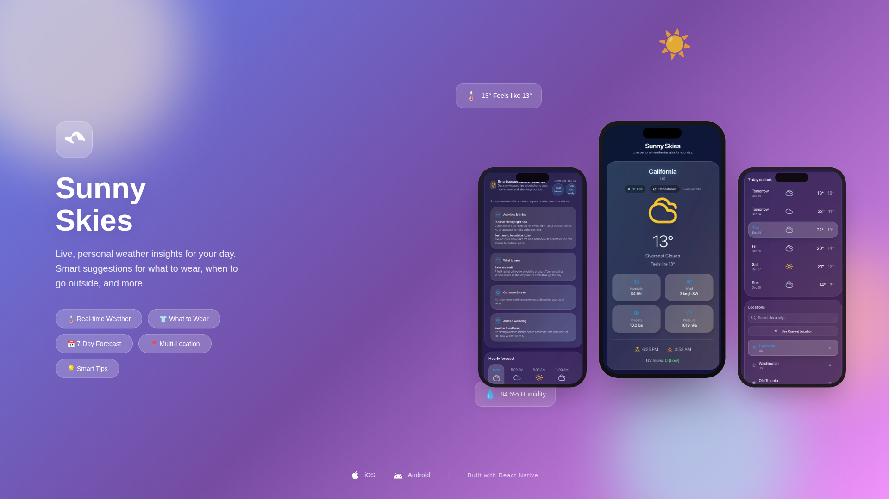

# Sunny Skies - Real-Time Weather Dashboard

A modern, responsive weather application built with React and TypeScript that provides real-time weather data, interactive forecasts, and AI-powered insights. Features a beautiful glassmorphism UI design that works seamlessly on both mobile and desktop devices.


## ✨ Features

- **Real-Time Weather Updates**: Automatic refresh every 60 seconds with manual refresh option
- **Interactive Forecasts**: Click on hourly or daily forecasts to see detailed weather information
- **AI-Powered Insights**: Smart suggestions for activities, clothing, commute planning, and health alerts
- **Personal Weather Profiles**: Customizable heat/cold sensitivity and commute hours
- **Location Management**: Save multiple locations with persistent storage
- **Responsive Design**: Optimized for mobile, tablet, and desktop screens
- **Beautiful UI**: Modern glassmorphism design with smooth animations
- **Live Status Indicator**: Visual feedback showing when data was last updated

## 🛠️ Tech Stack

- **Framework**: React 18.3+ with TypeScript
- **Build Tool**: Vite 5.4+
- **Styling**: Tailwind CSS 3.4+ with custom glassmorphism utilities
- **UI Components**: shadcn/ui (Radix UI primitives)
- **State Management**: React Query (TanStack Query) for server state
- **Routing**: React Router DOM 6.30+
- **Icons**: Lucide React
- **API**: OpenWeatherMap API (Free tier)

## 🌐 Weather API Service

This application uses **[OpenWeatherMap API](https://openweathermap.org/api)** to fetch real-time weather data and forecasts.

### API Details

- **Service Provider**: [OpenWeatherMap](https://openweathermap.org/)
- **API Plan**: Free tier (Current Weather and Forecast API)
- **Base URL**: `https://api.openweathermap.org`
- **Endpoints Used**:
  - `/data/2.5/weather` - Current weather conditions
  - `/data/2.5/forecast` - 5-day weather forecast with 3-hour intervals
  - `/geo/1.0/direct` - Geocoding API for location search
  - `/geo/1.0/reverse` - Reverse geocoding for location names

### API Features

- **Current Weather**: Real-time temperature, humidity, wind speed, visibility, pressure, UV index, and weather conditions
- **Hourly Forecast**: 24-hour forecast with 3-hour intervals
- **Daily Forecast**: 5-day weather forecast with min/max temperatures
- **Location Search**: Search and geocode cities worldwide
- **Geolocation Support**: Reverse geocoding for current location

### Getting Your API Key

1. Visit [OpenWeatherMap API](https://openweathermap.org/api)
2. Sign up for a free account
3. Navigate to **API Keys** in your account dashboard
4. Copy your API key
5. The free tier includes:
   - 60 calls per minute
   - Current weather data
   - 5-day/3-hour forecast
   - Geocoding API

**Documentation**: [OpenWeatherMap API Documentation](https://openweathermap.org/api)

## 📁 Directory Structure

```
sunny-skies-ui/
├── public/                 # Static assets
│   ├── favicon.ico
│   └── pwa-*.png          # PWA icons
├── src/
│   ├── assets/
│   │   └── images/       # App screenshots and images
│   ├── components/
│   │   ├── ui/           # shadcn/ui components
│   │   └── weather/      # Weather-specific components
│   │       ├── ApiKeyInput.tsx
│   │       ├── CurrentWeather.tsx
│   │       ├── DailyForecast.tsx
│   │       ├── HourlyForecast.tsx
│   │       ├── LocationSearch.tsx
│   │       ├── WeatherError.tsx
│   │       ├── WeatherInsights.tsx
│   │       └── WeatherLoading.tsx
│   ├── hooks/
│   │   ├── useWeather.ts          # Main weather data hook
│   │   ├── useWeatherProfile.ts  # User preferences hook
│   │   └── use-mobile.tsx        # Mobile detection hook
│   ├── lib/
│   │   ├── utils.ts              # Utility functions
│   │   ├── weatherInsights.ts    # AI insights generation
│   │   └── weatherUtils.ts       # Weather formatting utilities
│   ├── pages/
│   │   ├── Index.tsx             # Main weather dashboard
│   │   └── NotFound.tsx          # 404 page
│   ├── types/
│   │   └── weather.ts            # TypeScript type definitions
│   ├── App.tsx                   # Root component
│   ├── main.tsx                  # Entry point
│   └── index.css                 # Global styles
├── package.json
├── tailwind.config.ts            # Tailwind configuration
├── tsconfig.json                 # TypeScript configuration
└── vite.config.ts                # Vite configuration
```

## 🚀 Installation

### Prerequisites

- **Node.js**: v18.0.0 or higher
- **npm/yarn/bun**: Package manager of your choice

### Step 1: Clone the Repository

```bash
git clone <YOUR_GIT_URL>
cd sunny-skies-ui
```

### Step 2: Install Dependencies

Using npm:

```bash
npm install
```

Using yarn:

```bash
yarn install
```

Using bun:

```bash
bun install
```

## ⚙️ Setup & Configuration

### Step 1: Get Your OpenWeatherMap API Key

1. Visit [OpenWeatherMap](https://openweathermap.org/api)
2. Sign up for a free account
3. Navigate to **API Keys** section
4. Copy your API key (or generate a new one)

**Note**: This app uses the **free Weather API** plan. Make sure you have the "Current Weather and Forecast" API subscription enabled (free tier available).

### Step 2: Start the Development Server

```bash
npm run dev
```

The app will be available at `http://localhost:5173` (or the port shown in your terminal).

### Step 3: Configure API Key

1. When you first open the app, you'll see the API key input screen
2. Paste your OpenWeatherMap API key
3. Click **Save API Key**
4. The key will be stored securely in your browser's localStorage

**Security Note**: Never commit your API key to version control. The app uses localStorage to store your key locally.

### Step 4: Use the App

- **Search for a location**: Type a city name in the search box
- **Use current location**: Click "Use Current Location" (requires browser geolocation permission)
- **View forecasts**: Click on hourly or daily forecast cards to see detailed information
- **Customize profile**: Adjust your heat/cold sensitivity in the insights section

## 📜 Available Scripts

- `npm run dev` - Start development server
- `npm run build` - Build for production
- `npm run build:dev` - Build in development mode
- `npm run preview` - Preview production build locally
- `npm run lint` - Run ESLint

## 🎨 Features in Detail

### Real-Time Updates

- Weather data refreshes automatically every 60 seconds
- Manual refresh button available
- Live status indicator shows last update time
- Automatic refresh on window focus and network reconnect

### Interactive Forecasts

- **Hourly Forecast**: Scrollable 24-hour forecast with clickable cards
- **Daily Forecast**: 7-day forecast with detailed daily information
- Click any forecast item to see detailed weather information in the main card

### Smart Insights

- **Activity Recommendations**: Best times for outdoor activities
- **Clothing Suggestions**: Personalized outfit recommendations based on weather
- **Commute Alerts**: Weather warnings for your commute hours
- **Health Alerts**: Heat, cold, and hydration reminders

### Personalization

- Save multiple favorite locations
- Customize heat/cold sensitivity
- Set commute hours for personalized alerts
- All preferences saved in localStorage

## 🔒 Security & Privacy

- API keys are stored locally in browser localStorage
- No API keys are sent to external servers except OpenWeatherMap
- No user data is collected or stored on external servers
- All location data is processed client-side

## 📱 Responsive Design

The app is fully responsive and optimized for:

- **Mobile**: 320px - 768px
- **Tablet**: 768px - 1024px
- **Desktop**: 1024px+

## 🐛 Troubleshooting

### API Key Issues

- Ensure your OpenWeatherMap API key is valid
- Check that you have the "Current Weather and Forecast" API subscription enabled
- Wait a few minutes after generating a new API key before using it

### Geolocation Not Working

- Ensure your browser has location permissions enabled
- Use HTTPS (required for geolocation API)
- Try using the search function instead

### Build Issues

- Clear `node_modules` and reinstall: `rm -rf node_modules && npm install`
- Check Node.js version: `node --version` (should be 18+)

## 📄 License

This project is private and proprietary.

## 🤝 Contributing

This is a private project. For issues or suggestions, please contact the repository owner.

---

## 📸 Screenshots

### Desktop Views







### Display Showcases



---

**Built with ❤️ using React, TypeScript, and Tailwind CSS**
